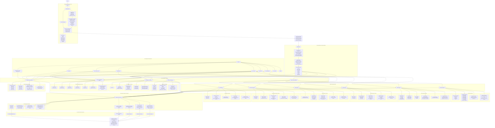

```mermaid
flowchart TB
    U["User"] --> UI["Chat UI"]

    subgraph UIX["Frontend Chat Awareness Layer"]
        UI --> INPUT["Message Input"]
        INPUT --> TAG["Tagging System<br/>@Case ID<br/>@Case Number<br/>@Case Name<br/>@Quoted Case Name"]
        INPUT --> FREE["Free-Text Question"]
        TAG --> SUGGEST["Case Suggestion Dropdown<br/>Search by case name<br/>Search by case ID<br/>Search by case number<br/>Search by FIR<br/>Show operator in suggestion<br/>Show case label in suggestion"]
        SUGGEST --> ACTIVE["Active Case Context Store<br/>Current case badge<br/>Locked case context<br/>Clear case action<br/>Switch case action"]
        ACTIVE --> QUICK["Quick Actions<br/>Overview<br/>Files<br/>CDR Summary<br/>IPDR Summary<br/>SDR Summary<br/>Tower Summary<br/>ILD Summary<br/>Timeline"]
        FREE --> ACTIVE
    end

    ACTIVE --> ROUTER["Chat Request Builder<br/>Send active case ID<br/>Send active case name<br/>Send case type if known<br/>Send session history<br/>Send free-text question"]
    ROUTER --> API["Chatbot API"]

    subgraph RESOLVE["Case Resolution And Context Binding"]
        API --> DETECT["Intent And Context Detection<br/>Is message case-specific?<br/>Is there an active case?<br/>Is there an @tag?<br/>Is there a FIR reference?<br/>Is there a module request?<br/>Is this a follow-up question?"]
        DETECT --> MATCH["Case Resolver<br/>Resolve by case ID<br/>Resolve by case number<br/>Resolve by case name<br/>Resolve by FIR<br/>Resolve by tagged case"]
        MATCH --> BIND["Bound Case Context<br/>case_id<br/>case_name<br/>case_number<br/>fir_number<br/>operator<br/>case_type<br/>status<br/>created_at<br/>description"]
    end

    subgraph KNOWLEDGE["Case Knowledge Assembly"]
        BIND --> PROFILE["Case Profile Summary"]
        BIND --> FILES["File Intelligence Summary"]
        BIND --> COUNTS["Dataset Availability And Counts"]
        BIND --> MODULES["Module Summary Builder"]
        BIND --> TIMELINE["Timeline Summary Builder"]
    end

    subgraph PROFILEBOX["Case Profile Summary"]
        PROFILE --> P1["Core Identity<br/>Case ID<br/>Case Name<br/>Case Number<br/>FIR Number<br/>Case Type"]
        PROFILE --> P2["Administrative Context<br/>Operator<br/>Status<br/>Priority if available<br/>Created Date<br/>Updated Date if available"]
        PROFILE --> P3["Narrative Context<br/>Description<br/>Investigation Details<br/>Assigned or created-by context if relevant"]
    end

    subgraph FILEBOX["File Intelligence Summary"]
        FILES --> F1["File Count"]
        FILES --> F2["File Names<br/>Original Names<br/>Uploaded Timestamps"]
        FILES --> F3["Classification Details<br/>Declared Type<br/>Detected Type<br/>Confidence<br/>Classification Result"]
        FILES --> F4["Parsing Details<br/>Parse Status<br/>Rows Accepted<br/>Rows Rejected"]
        FILES --> F5["File Awareness Output<br/>Which module files exist?<br/>Which files are missing?<br/>Which uploads failed?"]
    end

    subgraph COUNTBOX["Dataset Availability And Counts"]
        COUNTS --> C1["CDR Exists?<br/>CDR Row Count"]
        COUNTS --> C2["IPDR Exists?<br/>IPDR Row Count"]
        COUNTS --> C3["SDR Exists?<br/>SDR Row Count"]
        COUNTS --> C4["Tower Exists?<br/>Tower Row Count"]
        COUNTS --> C5["ILD Exists?<br/>ILD Row Count"]
        COUNTS --> C6["Timeline Exists?<br/>Timeline Event Count"]
        COUNTS --> C7["Case Readiness Summary<br/>What is available?<br/>What is missing?<br/>What can be answered right now?"]
    end

    subgraph MODULEBOX["Module Summary Builder"]
        MODULES --> OVERVIEW["Overview Summary"]
        MODULES --> CDR["CDR Summary"]
        MODULES --> IPDR["IPDR Summary"]
        MODULES --> SDR["SDR Summary"]
        MODULES --> TOWER["Tower Dump Summary"]
        MODULES --> ILD["ILD Summary"]
    end

    subgraph OVERVIEWBOX["Overview Summary"]
        OVERVIEW --> O1["Basic Case Snapshot<br/>Identity block<br/>Operator<br/>Created date<br/>Status"]
        OVERVIEW --> O2["Availability Snapshot<br/>Files available?<br/>CDR available?<br/>IPDR available?<br/>SDR available?<br/>Tower available?<br/>ILD available?<br/>Timeline available?"]
        OVERVIEW --> O3["Missing Data Notice<br/>If datasets are absent, clearly report what is not uploaded yet"]
        OVERVIEW --> O4["Follow-Up Guidance<br/>Ask user what they want next:<br/>Overview / Files / CDR / IPDR / SDR / Tower / ILD / Timeline"]
    end

    subgraph CDRBOX["CDR Summary Contents"]
        CDR --> CD1["Volume Metrics<br/>Total records<br/>Date range<br/>Total duration<br/>Average duration"]
        CDR --> CD2["Party Metrics<br/>Unique A parties<br/>Unique B parties<br/>Top 5 B parties"]
        CDR --> CD3["Device Metrics<br/>Unique IMEI<br/>Top IMEI"]
        CDR --> CD4["Pattern Metrics<br/>Call type distribution<br/>Daily communication trend<br/>Hourly pattern if available"]
        CDR --> CD5["Location Metrics<br/>Top locations if available"]
        CDR --> CD6["Empty-State Rule<br/>If no CDR exists, respond with 'No CDR records available for this case yet'"]
    end

    subgraph IPDRBOX["IPDR Summary Contents"]
        IPDR --> IP1["Volume Metrics<br/>Total records<br/>Time spread"]
        IPDR --> IP2["Subscriber Metrics<br/>Unique MSISDN<br/>Unique IMSI<br/>Unique IMEI"]
        IPDR --> IP3["Network Metrics<br/>Unique source IP<br/>Top source IPs<br/>Top destination IPs if available"]
        IPDR --> IP4["Intelligence Metrics<br/>Geo or enrichment availability<br/>Known IP intelligence if present"]
        IPDR --> IP5["Empty-State Rule<br/>If no IPDR exists, report that clearly"]
    end

    subgraph SDRBOX["SDR Summary Contents"]
        SDR --> SD1["Subscriber Volume<br/>Total subscriber records"]
        SDR --> SD2["Identity Fields<br/>Subscriber names<br/>Phone numbers<br/>ID proof fields<br/>Email fields"]
        SDR --> SD3["Profile Coverage<br/>Address fields<br/>Connection type<br/>Retailer or point-of-sale info if present"]
        SDR --> SD4["Match Insights<br/>Top phone or identity matches"]
        SDR --> SD5["Empty-State Rule<br/>If no SDR exists, report that clearly"]
    end

    subgraph TOWERBOX["Tower Dump Summary Contents"]
        TOWER --> TW1["Volume Metrics<br/>Total records<br/>Time range"]
        TOWER --> TW2["Movement Metrics<br/>Unique numbers<br/>Unique towers or cells"]
        TOWER --> TW3["Concentration Metrics<br/>Top towers<br/>Top cells<br/>High-density areas if available"]
        TOWER --> TW4["Pattern Insights<br/>Movement hints<br/>Co-location hints if available"]
        TOWER --> TW5["Empty-State Rule<br/>If no Tower Dump exists, report that clearly"]
    end

    subgraph ILDBOX["ILD Summary Contents"]
        ILD --> IL1["Volume Metrics<br/>Total records<br/>Date range"]
        ILD --> IL2["International Contact Metrics<br/>Top contacts<br/>Direction or country clues if available"]
        ILD --> IL3["Duration Metrics<br/>Call duration patterns"]
        ILD --> IL4["Pattern Insights<br/>International communication behavior if available"]
        ILD --> IL5["Empty-State Rule<br/>If no ILD exists, report that clearly"]
    end

    subgraph TIMELINEBOX["Timeline Summary Builder"]
        TIMELINE --> T1["Unified Event Stream<br/>CDR events<br/>IPDR events<br/>Tower events<br/>ILD events<br/>Upload events"]
        TIMELINE --> T2["Timeline Metrics<br/>Event count<br/>Earliest event<br/>Latest event<br/>Activity clusters"]
        TIMELINE --> T3["Timeline Answer Mode<br/>Summarize recent activity<br/>Summarize chronological flow<br/>Explain what modules contribute to timeline"]
        TIMELINE --> T4["Empty-State Rule<br/>If no timeline data exists, report that clearly"]
    end

    subgraph DATASOURCES["Case-Awareness Data Sources"]
        DB["Database"] --> CASET["cases"]
        DB --> FILET["uploaded_files"]
        DB --> CLASST["file_classifications"]
        DB --> CDRT["cdr_records"]
        DB --> IPDRT["ipdr_records"]
        DB --> SDRT["sdr_records"]
        DB --> TOWERT["tower_dump_records"]
        DB --> ILDT["ild_records"]
        DB --> AUDITT["audit_logs or system activity if used"]
    end

    CASET --> PROFILE
    FILET --> FILES
    CLASST --> FILES
    CDRT --> COUNTS
    CDRT --> CDR
    IPDRT --> COUNTS
    IPDRT --> IPDR
    SDRT --> COUNTS
    SDRT --> SDR
    TOWERT --> COUNTS
    TOWERT --> TOWER
    ILDT --> COUNTS
    ILDT --> ILD
    FILET --> TIMELINE
    CDRT --> TIMELINE
    IPDRT --> TIMELINE
    TOWERT --> TIMELINE
    ILDT --> TIMELINE
    AUDITT --> TIMELINE

    subgraph RESPONSE["Case-Aware Response Generation"]
        COUNTS --> DECIDE["Response Decision Layer"]
        PROFILE --> DECIDE
        FILES --> DECIDE
        OVERVIEW --> DECIDE
        CDR --> DECIDE
        IPDR --> DECIDE
        SDR --> DECIDE
        TOWER --> DECIDE
        ILD --> DECIDE
        TIMELINE --> DECIDE

        DECIDE --> R1["If user only tags case<br/>Return case overview + availability + missing data + follow-up question"]
        DECIDE --> R2["If user asks module-specific question<br/>Return only that module summary for the bound case"]
        DECIDE --> R3["If module data is missing<br/>Return explicit empty-state response"]
        DECIDE --> R4["If no case is bound<br/>Return case-selection guardrail"]
    end

    subgraph GROUNDED["Grounding And Trust Rules"]
        DECIDE --> G1["Source Block<br/>Case used<br/>Tables used<br/>Files used"]
        DECIDE --> G2["No Hallucination Rule<br/>Never invent module data<br/>Never invent counts<br/>Never fake findings"]
        DECIDE --> G3["Missing Data Rule<br/>Say what is missing<br/>Suggest upload or next action"]
        DECIDE --> G4["Context Persistence Rule<br/>Follow-up questions remain inside the current case until cleared or switched"]
    end

    subgraph OUTPUT["User-Visible Chatbot Outcomes"]
        R1 --> OUT1["Case Overview Answer"]
        R2 --> OUT2["Module-Specific Answer"]
        R3 --> OUT3["Missing-Data Answer"]
        R4 --> OUT4["Select-Or-Tag-A-Case Prompt"]
        G1 --> OUT5["Cited And Auditable Answer"]
    end

    OUT1 --> USERVIEW["What the user should understand after each answer<br/>Which case is active<br/>What data exists<br/>What data is missing<br/>What can be asked next<br/>What evidence or source was used"]
    OUT2 --> USERVIEW
    OUT3 --> USERVIEW
    OUT4 --> USERVIEW
    OUT5 --> USERVIEW
```
