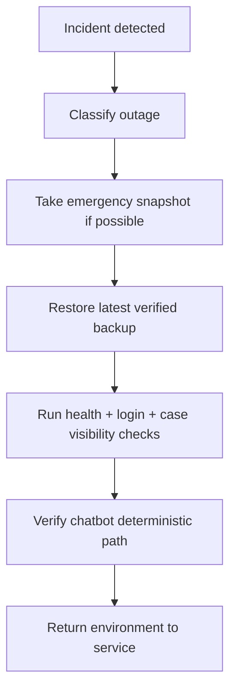

# Disaster Recovery

## Objective
Restore SHAKTI with bounded data loss and a documented sequence during serious operational incidents.

## Recovery Targets
- RPO target: 24 hours or better
- RTO target: same-day internal recovery for pre-production

## Incident Classes

### Class 1: Single-service failure
- frontend unavailable
- backend crash
- Ollama unavailable

Recovery:
- restore service
- confirm `/api/health/live`
- confirm `/api/health/ready`

### Class 2: Data-plane degradation
- Postgres failure
- uploads mount unavailable
- corrupted seed principals

Recovery:
- stop writes
- take immediate snapshot if possible
- restore latest verified bundle to isolated environment
- validate login + case visibility
- promote restored state

### Class 3: Host loss
- machine failure
- disk loss
- irrecoverable local runtime state

Recovery:
- provision replacement host
- restore repo and env secrets
- restore latest off-machine backup bundle
- validate startup and smoke tests

## Recovery Sequence

## Mandatory Validation After Recovery
- admin login works
- `/api/health/ready` returns healthy or controlled degraded
- latest visible case count is plausible
- uploads archive contents mounted correctly
- deterministic chatbot path works

## Communication Checkpoints
- incident acknowledged
- restore source bundle identified
- restore verification completed
- environment returned to service

## Evidence To Preserve
- failing health payloads
- backup/restore status files
- restore report
- startup logs
