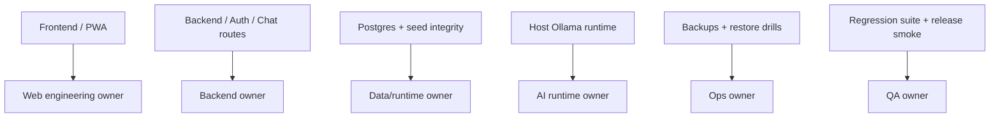

# Environment Ownership

## Scope
This document defines runtime ownership boundaries for SHAKTI during pre-production testing.

## Runtime Components

### Frontend / PWA
- Runtime: `frontend`
- Responsibility:
  - officer-facing UI
  - route loading states
  - auth bootstrap orchestration
  - mobile responsiveness and bundle discipline
- Primary env:
  - `VITE_API_URL`
  - `VITE_CHATBOT_URL`

### Backend / API
- Runtime: `backend`
- Responsibility:
  - auth/session lifecycle
  - case CRUD
  - chatbot routing
  - health/readiness/startup contracts
  - backup and restore metadata exposure
- Primary env:
  - `JWT_SECRET`
  - `JWT_EXPIRES_IN`
  - `REFRESH_TOKEN_EXPIRES_IN`
  - `COOKIE_SECURE`
  - `COOKIE_SAMESITE`
  - `DB_HOST`
  - `DB_PORT`
  - `DB_NAME`
  - `DB_USER`
  - `DB_PASSWORD`
  - `OLLAMA_BASE_URL`
  - `OLLAMA_MODEL`
  - `BACKUP_STATUS_FILE`
  - `RESTORE_STATUS_FILE`

### Database
- Runtime: `postgres`
- Responsibility:
  - source of truth for users, sessions, cases, uploads metadata, and chatbot persistence
  - schema integrity
  - seed principal availability

### Upload Storage
- Runtime: backend-mounted upload volume
- Responsibility:
  - uploaded evidentiary files
  - file availability across restarts
  - archive participation in backup bundles

### Ollama Runtime
- Runtime: host-local Ollama
- Responsibility:
  - LLM-backed chatbot synthesis branch
  - degraded availability allowed when deterministic chatbot branches remain usable

### Backup Operations
- Runtime: repo scripts + host scheduler
- Responsibility:
  - nightly backup generation
  - pre-change snapshot creation
  - restore drill verification
  - off-machine backup copying

## Operational Ownership Map

## Change Responsibility
- Frontend owners approve UI loading behavior, lazy loading, and mobile bundle thresholds.
- Backend owners approve auth contracts, health endpoint shapes, and chatbot behavior.
- Runtime/data owners approve DB connection changes, schema changes, retention policy, and restore drills.
- Ops owners approve backup schedule changes and storage target changes.

## Release Gate Expectations
- No release proceeds without:
  - healthy `/api/health/ready`
  - latest backup timestamp recorded
  - latest restore drill result recorded
  - frontend bundle budgets passing
  - critical test suite passing
