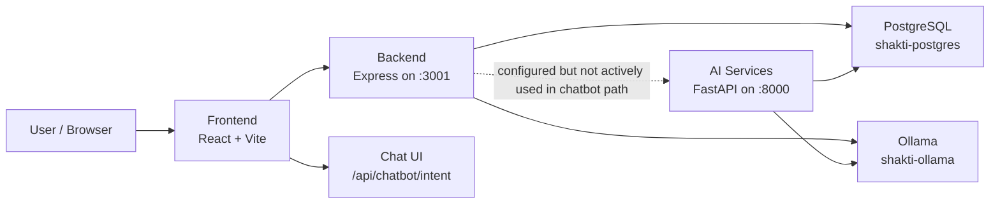
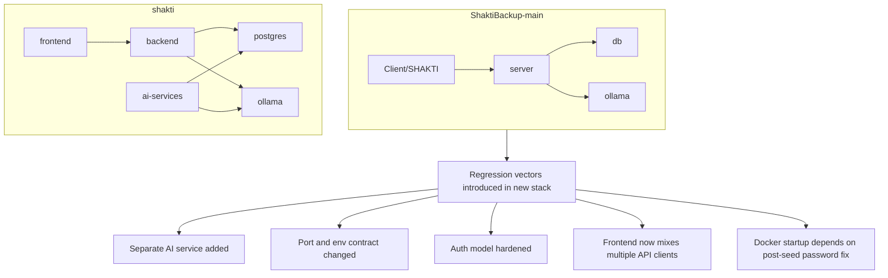
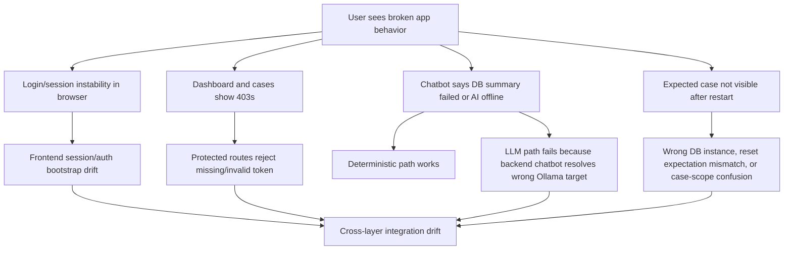

# SHAKTI Project Audit And Readiness Report

Date: April 5, 2026
Scope: `shakti` (primary), with `ShaktiBackup-main` used as a regression baseline only
Classification: Internal technical audit

## Executive Summary

`shakti` is not production-ready in its current state. The codebase has a workable foundation, and several core backend endpoints are healthy, but the system is currently blocked by integration drift across Docker, chatbot runtime wiring, frontend auth/session bootstrap, and inconsistent API contracts.

Overall readiness rating: **42 / 100**

Current deployment risk: **High**

Main reasons:

- The chatbot's deterministic branches work, but LLM-backed chat is effectively offline in the live Docker stack.
- The frontend uses multiple API layers and inconsistent auth/session handling, which creates unstable browser behavior even when backend endpoints are healthy.
- The database is reachable and currently contains valid users and cases, but persistence and visibility expectations are not trustworthy enough for investigative workflows.
- Security posture is not yet appropriate for a government-grade mobile investigation product.

## Audit Scope And Method

This audit was built from:

- Source inspection of the new monorepo in `shakti`
- Focused comparison against `ShaktiBackup-main`
- Runtime validation against the active Docker stack on April 5, 2026
- Direct API smoke tests against the live backend
- Direct PostgreSQL inspection of the active `shakti` database

Validation performed during this audit:

- Backend login succeeds with demo credentials
- `GET /api/auth/session` succeeds with a valid JWT
- `GET /api/cases` succeeds with a valid JWT
- Deterministic chatbot branches succeed
- LLM-backed chatbot prompts return "AI Model Offline"
- Ollama container is up, but no matching backend `POST /api/chat` traffic appears in Ollama logs during the failing LLM request
- Frontend build passes
- Backend syntax/lint pass completes

## Final Assessment

The project is best described as **functional in parts, but operationally inconsistent**. The backend is more stable than the browser symptoms suggest. The most severe failures are integration failures between layers, not a total collapse of the backend or database.

Top blockers:

| Priority | Blocker | Severity | Current effect |
| --- | --- | --- | --- |
| P0 | Chatbot generative path uses wrong Ollama env contract | Critical | AI-backed chatbot answers are unavailable |
| P0 | Frontend auth/session/bootstrap drift | Critical | Browser shows login/session instability and `403` cascades |
| P1 | API response-shape drift across UI clients | High | Case, file, and dashboard flows are brittle and inconsistent |
| P1 | Persistence/reset workflow is fragile | High | Case visibility after restart is not trustworthy |
| P1 | Security hardening is incomplete | High | Not suitable yet for sensitive mobile investigative use |

## Architecture Overview

### Current New-Project Runtime

### Old vs New Regression Map

### Failure Flow For Reported Symptoms

## Confirmed Findings

### 1. LLM-backed chatbot is broken in the live Docker stack

Status: **Confirmed**

Symptom:

- Greeting and deterministic summary prompts work.
- Prompts that require model generation return:
  - `AI Model Offline`
  - fallback guidance instead of a generated answer

Evidence:

- Backend chatbot runtime reads `OLLAMA_URL` from [`backend/services/chatbot/config.js`](../backend/services/chatbot/config.js).
- Docker compose injects `OLLAMA_BASE_URL`, not `OLLAMA_URL`, into the backend service in [`docker-compose.yml`](../docker-compose.yml).
- The live backend container config shows `OLLAMA_BASE_URL=http://ollama:11434`, but not `OLLAMA_URL`.
- A direct LLM-backed chatbot prompt returned the offline fallback message even while `shakti-ollama` was running.
- Ollama container logs show `GET /api/tags`, but no corresponding backend `POST /api/chat` during the failing LLM request.

Root issue:

- The active Express chatbot path does not use the same env contract as Docker.
- Inside the backend container, the chatbot can fall back to `http://localhost:11434`, which is incorrect for container-to-container traffic.

Impact:

- The chatbot appears partially alive, which is misleading.
- Officers can still get some deterministic summaries, but the main assistant experience is unavailable.

Recommended fix:

- Normalize the backend chatbot to read `OLLAMA_BASE_URL`, or set both `OLLAMA_URL` and `OLLAMA_BASE_URL` consistently in Docker and local `.env`.
- Add a startup log that prints the resolved Ollama target for the Express chatbot path.
- Add a health probe that verifies `/api/chat` reachability, not just `/api/tags`.

### 2. Backend auth and case APIs are healthy when called directly

Status: **Confirmed**

Evidence:

- Direct `POST /api/auth/login` succeeded with `BK-9999 / admin@police.gov.in / Shakti@123`.
- Direct `GET /api/auth/session` with a valid JWT returned `200`.
- Direct `GET /api/cases?limit=50` with a valid JWT returned `200`.

Conclusion:

- The backend is not the primary cause of the browser's login/session symptom.
- The browser issue is more consistent with frontend bootstrap, token handling, or request-routing drift.

### 3. Frontend auth/session handling is inconsistent and likely responsible for the browser login instability

Status: **Confirmed**

Evidence:

- Auth state stores both `token` and `shakti_token` in [`frontend/src/stores/authStore.ts`](../frontend/src/stores/authStore.ts).
- Shared API client in [`frontend/src/lib/api.ts`](../frontend/src/lib/api.ts) uses `shakti_token`.
- `SessionClock` reads `token` and calls a relative `/api/auth/session` in [`frontend/src/components/dashboard/SessionClock.tsx`](../frontend/src/components/dashboard/SessionClock.tsx).
- Other pages call absolute or resolved API URLs directly in [`frontend/src/pages/Dashboard.tsx`](../frontend/src/pages/Dashboard.tsx), [`frontend/src/pages/CaseView.tsx`](../frontend/src/pages/CaseView.tsx), and [`frontend/src/pages/CreateCasePage.tsx`](../frontend/src/pages/CreateCasePage.tsx).
- The UI also has a second API layer in [`frontend/src/components/lib/apis.ts`](../frontend/src/components/lib/apis.ts).

Root issue:

- There is no single frontend source of truth for auth token retrieval, API base resolution, or response parsing.

Impact:

- Browser behavior can diverge from direct backend behavior.
- Some routes work while others fail with `401`, `403`, or JSON parse errors depending on which client path they use.

Recommended fix:

- Consolidate frontend API access to one client.
- Use one token key only.
- Route all auth/session requests through the same API-base resolver.
- Add a single app bootstrap that verifies session once and hydrates auth state for the rest of the UI.

### 4. Browser-side `403` cascades are auth failures on protected routes, not primary DB outages

Status: **Confirmed**

Evidence:

- Nearly all business routes require JWT auth via [`backend/middleware/auth.js`](../backend/middleware/auth.js).
- Dashboard, cases, files, uploads, settings, and most analytics endpoints are protected.
- The user's console screenshot shows repeated `403` responses on `/api/dashboard/stats`, `/api/cases`, and `/api/auth/session`.
- Direct authenticated calls to the same backend routes succeed.

Conclusion:

- The browser symptom is consistent with missing or invalid auth headers in some UI request paths.
- The database itself is not the primary explanation for the `403` cascade.

### 5. API response-shape drift is real and creates UI brittleness

Status: **Confirmed**

Examples:

- `/api/cases` returns `{ data, pagination }` in [`backend/routes/cases.js`](../backend/routes/cases.js), but older-style client code still assumes shapes like `{ cases, total }` in [`frontend/src/lib/api.ts`](../frontend/src/lib/api.ts).
- `/api/files` has two list styles:
  - raw array from `GET /api/files?caseId=...`
  - `{ files }` from `GET /api/files/:caseId`
- `/api/dashboard/stats` returns `totalFiles`, while historical naming patterns and older UI expectations imply `fileUploads`.
- `/api/auth/session` is called through inconsistent token and base-url strategies.

Impact:

- Even when endpoints are healthy, the UI can mis-handle successful responses.
- This is one of the clearest reasons the app can look broken while the backend is only partially at fault.

### 6. Database reset and seed workflow is fragile

Status: **Confirmed**

Evidence:

- [`database/seed.sql`](../database/seed.sql) inserts placeholder password hashes.
- The same file explicitly states that `fix-passwords.js` must be run afterward.
- [`scripts/up.mjs`](../scripts/up.mjs) attempts to normalize passwords after Docker startup.
- If PostgreSQL is recreated without the post-seed normalization step completing, login can break even though users exist.

Current live state:

- The active database now contains valid bcrypt hashes, so this is **not** the current live cause of login failure.
- It remains a confirmed deployment fragility and a likely source of "it worked before reset, broke after refresh" incidents.

### 7. The expected newer case is not present in the active `shakti` database snapshot

Status: **Confirmed**

Observed DB snapshot on April 5, 2026:

- Users: 2
- Officers: 5
- Cases: 2
- Uploaded files: 0
- CDR/IPDR/SDR/Tower/ILD records: 0

Visible cases:

- `Test Case Alpha`
- `ZXC`

Conclusion:

- The user-expected case created "last night" is not visible in the active `shakti` database snapshot used during this audit.

Most plausible explanations:

- It was created in a different DB instance or older project
- It was created before a Docker volume reset
- It exists in another scope but is hidden by auth/assignment logic

This concern should be treated as a **data trust** issue until persistence and environment ownership are made explicit.

### 8. The new AI service exists, but the active chatbot path still runs through the Express backend

Status: **Confirmed**

Evidence:

- Docker starts `ai-services`.
- Backend env includes `AI_SERVICE_URL`.
- Source inspection did not show active Express chatbot usage of `AI_SERVICE_URL`.
- Frontend chatbot calls `/api/chatbot/intent` on the backend, not `/ai/chatbot/query` on the FastAPI service.

Impact:

- The stack has more moving parts than the active product path requires.
- This increases operational complexity without currently reducing risk.

## High-Confidence Likely Findings

These are strongly supported by the code and runtime evidence, but not every step was reproduced through the exact failing browser path.

### 1. The login-page JSON parse error is likely caused by frontend request-routing drift, not broken credentials

Likelihood: **High**

Why:

- The user screenshot shows `Failed to execute 'json' on 'Response': Unexpected end of JSON input`.
- Direct backend login works.
- `SessionClock` uses a relative `/api/auth/session` path and a different token key than the rest of the app.
- Mixed absolute vs relative API calls can produce empty or non-JSON responses in dev/proxy scenarios.

### 2. "Create case is broken" is likely a frontend contract/bootstrap issue, not a dead backend create-case route

Likelihood: **High**

Why:

- The create-case page uses direct `fetch`.
- Other UI areas use different client abstractions and different response assumptions.
- Repeated `403` auth failures in the browser would block create-case even if the route itself is healthy.
- Backend case creation route is straightforward and protected primarily by JWT auth.

### 3. The case disappearance is likely tied to environment ownership rather than random database loss

Likelihood: **High**

Why:

- The old and new projects both exist locally.
- Docker and persistence models changed between them.
- The app also moved from the old simple container topology to a more complex stack with different bootstrap steps.

## Needs Follow-Up

These should be treated as unresolved until implemented checks are added.

- Confirm whether the missing case exists in the old project's DB or another Postgres volume.
- Confirm whether all frontend pages have been migrated off the legacy client assumptions.
- Confirm whether the AI service is intended to replace any active Express chatbot functionality.
- Confirm whether mobile app integration expects cookie-based auth, bearer token auth, or both.
- Confirm whether persistence requirements demand named, backed-up Docker volumes or external Postgres.

## Security And Hardening Findings

### 1. JWT is stored in `localStorage`

Risk: **High**

Why it matters:

- A mobile-adjacent or hybrid web app handling sensitive investigative data should avoid exposing long-lived bearer tokens to XSS-accessible storage.

Evidence:

- Token storage appears throughout the frontend, especially [`frontend/src/stores/authStore.ts`](../frontend/src/stores/authStore.ts), [`frontend/src/lib/api.ts`](../frontend/src/lib/api.ts), and [`frontend/src/components/lib/apis.ts`](../frontend/src/components/lib/apis.ts).

### 2. Fallback JWT secrets are hardcoded in code

Risk: **High**

Evidence:

- [`backend/middleware/auth.js`](../backend/middleware/auth.js)
- [`backend/routes/auth.js`](../backend/routes/auth.js)

Why it matters:

- Secret fallback behavior is dangerous for any environment handling real users or sensitive records.

### 3. Dashboard route uses dynamic SQL string interpolation

Risk: **Medium**

Evidence:

- [`backend/routes/dashboard.js`](../backend/routes/dashboard.js)

Why it matters:

- Current values come from JWT-derived server-side state, so this is not the most urgent exploit path.
- It is still an unsafe pattern and should be replaced with parameterized queries for maintainability and future-proofing.

### 4. Duplicate API clients create security and correctness drift

Risk: **High**

Evidence:

- [`frontend/src/lib/api.ts`](../frontend/src/lib/api.ts)
- [`frontend/src/components/lib/apis.ts`](../frontend/src/components/lib/apis.ts)

Why it matters:

- Security headers, token selection, error handling, and response parsing diverge across the app.

### 5. Observability is too weak for incident response

Risk: **Medium**

Current state:

- There is some audit logging and some chatbot diagnostics.
- There is not enough structured health reporting to quickly distinguish:
  - auth failure
  - proxy/base-url failure
  - DB outage
  - Ollama connectivity failure
  - AI service irrelevance or drift

### 6. Testing posture is not sufficient

Risk: **High**

Evidence:

- Root, frontend, and backend package manifests do not define meaningful project test scripts.
- Frontend build passes.
- Backend syntax/lint check passes.
- No meaningful automated regression coverage was found for auth, case persistence, chatbot, or Docker startup flows.

### 7. Frontend bundle health needs work

Risk: **Medium**

Evidence:

- Production frontend build passes, but Vite reports large chunks over 500 kB.
- `TowerDumpAnalysis`, `xlsx`, and related payloads are especially large.

Impact:

- Poor mobile responsiveness
- Slower cold starts
- Higher crash risk on constrained devices

## Readiness Scorecard

| Area | Score / 10 | Status | Notes |
| --- | --- | --- | --- |
| Auth backend | 7 | Partially ready | Direct backend auth works |
| Auth frontend | 3 | Not ready | Token/base-url/session handling is inconsistent |
| Case management | 4 | Fragile | Backend route exists, browser flow is not trustworthy yet |
| Database connectivity | 7 | Partially ready | DB is up and queryable |
| Database persistence trust | 3 | Not ready | Missing-case concern is unresolved |
| Chatbot deterministic features | 7 | Partially ready | FIR/case summaries work |
| Chatbot generative AI | 2 | Not ready | Live LLM path is offline |
| File ingestion | 4 | Fragile | Route design exists, but no current data and UI drift remains |
| Docker/dev ergonomics | 4 | Fragile | Startup works, but env contracts are inconsistent |
| Observability | 4 | Fragile | Hard to isolate failures quickly |
| Security posture | 3 | Not ready | Token storage and secret handling need improvement |
| Release readiness | 2 | Not ready | Not yet suitable for sensitive mobile deployment |

## Browser Symptom To Root-Cause Matrix

| Symptom | Browser-layer explanation | API-layer explanation | Likely root cause |
| --- | --- | --- | --- |
| Login page JSON parse error | Response handled inconsistently in frontend bootstrap path | Backend login itself works when called directly | Frontend base-url/session drift |
| Dashboard `403` spam | Browser requests protected routes without stable auth context | Protected routes reject invalid/missing JWT | Inconsistent token handling across UI clients |
| Create case appears broken | Create flow depends on auth and direct `fetch` path | Protected create route likely blocked when auth state is unstable | Frontend auth/bootstrap drift plus contract inconsistency |
| Chatbot says DB failed or AI offline | Chat UI mixes deterministic and generative branches | Deterministic routes work, LLM route does not | Wrong Ollama env contract in active backend chatbot |
| Last night's case missing | UI cannot reliably prove persistence | Active DB snapshot does not include expected case | Wrong DB instance, reset, or environment mismatch |

## Evidence Snapshot

### Active Runtime Containers

Observed running containers included:

- `shakti-frontend`
- `shakti-backend`
- `shakti-ai-services`
- `shakti-postgres`
- `shakti-ollama`

### Direct API Validation

Validated on April 5, 2026:

- `POST /api/auth/login` -> `200`
- `GET /api/auth/session` with valid JWT -> `200`
- `GET /api/cases?limit=50` with valid JWT -> `200`
- `POST /api/chatbot/intent` with greeting -> `200`
- `POST /api/chatbot/intent` with deterministic FIR summary -> `200`
- `POST /api/chatbot/intent` with LLM-backed question -> `200` response body containing AI-offline fallback

### Active Database Snapshot

Observed counts:

- Users: 2
- Officers: 5
- Cases: 2
- Uploaded files: 0
- CDR records: 0
- IPDR records: 0
- SDR records: 0
- Tower dump records: 0
- ILD records: 0

Observed cases:

- `Test Case Alpha`
- `ZXC`

## Old vs New Project Comparison Summary

| Area | Old project | New project | Audit conclusion |
| --- | --- | --- | --- |
| Runtime topology | Simpler: client + server + DB + Ollama | More complex: frontend + backend + AI service + DB + Ollama | Complexity increased faster than contract discipline |
| Chatbot path | Node server path directly aligned with simpler stack | Express chatbot remains active, AI service added in parallel | New architecture is not fully consolidated |
| Docker env model | Narrower and easier to reason about | Multiple services with mixed env expectations | Regression risk increased materially |
| Auth model | Simpler | Hardened JWT model | Security intent improved, but frontend migration is incomplete |
| Case/file flows | Older and simpler | More features, more protected routes, more contract drift | Capability increased, reliability decreased |

## Remediation Roadmap

### Phase 0: Immediate blockers

Target: restore reliable demo and internal-use behavior

1. Unify Ollama env resolution across backend and Docker
2. Add explicit backend startup logging for resolved Ollama endpoint
3. Collapse frontend auth/session access to one token source and one API client
4. Replace all relative auth/session fetches with the shared API-base resolver
5. Normalize `/api/cases`, `/api/files`, and `/api/dashboard/stats` response handling in the UI
6. Add one visible diagnostics panel for:
   - auth status
   - backend health
   - DB health
   - Ollama health

### Phase 1: Short-term hardening

Target: make the app safe for repeatable internal testing

1. Remove fallback JWT secrets from code
2. Replace dynamic SQL string building with parameterized queries
3. Move away from `localStorage` bearer tokens for sensitive deployment targets
4. Add a single session bootstrap flow on app load
5. Make Docker startup deterministic for seed users and password setup
6. Decide whether `ai-services` is active product infrastructure or future infrastructure

### Phase 2: Pre-production readiness

Target: prepare for a serious mobile-backed release

1. Add automated tests for:
   - login
   - session bootstrap
   - dashboard load
   - create case
   - case visibility after restart
   - chatbot deterministic and LLM branches
2. Add persistence and backup strategy for case data and volumes
3. Add structured health endpoints and startup self-checks
4. Optimize frontend bundle size for mobile usage
5. Document environment ownership, runbooks, and disaster recovery

## Fix Validation Checklist

Use this checklist after remediation:

- [ ] Backend chatbot resolves the intended Ollama endpoint in logs
- [ ] LLM-backed chatbot prompt returns a real generated answer
- [ ] Greeting and deterministic summaries still work
- [ ] Login succeeds in browser with no JSON parse error
- [ ] Dashboard loads without `403` cascades
- [ ] Create case succeeds from the UI
- [ ] Newly created case is still visible after container restart
- [ ] Session clock uses the same auth token source as the rest of the app
- [ ] All case/file/dashboard UI paths use one API client
- [ ] Docker startup produces usable demo users without a manual repair step

## Reproduction Matrix For Future Debugging

| Flow | Repro step | Expected | Current audit result |
| --- | --- | --- | --- |
| Login | Sign in as `BK-9999 / admin@police.gov.in / Shakti@123` | UI lands on dashboard cleanly | Backend works, browser path unstable |
| Session | Load dashboard session timer | Valid session duration JSON | Direct API works, frontend path is inconsistent |
| Dashboard | Open dashboard after login | Stats and cases load | Browser can fail with auth cascade |
| Create Case | Submit new case from UI | Case persists and appears in case list | Not yet trustworthy from UI layer |
| Chatbot deterministic | Ask `FIR 3 summary` | DB-backed summary | Works |
| Chatbot generative | Ask a contextual investigative question | LLM-generated answer | Fails with AI-offline fallback |
| Persistence | Restart stack and reload cases | Previously created cases remain visible | Missing-case concern unresolved |

## Final Conclusion

The new `shakti` project is closer to a real product than the old backup, but it is currently held back by integration discipline rather than raw feature coverage. The backend and database are healthier than the browser makes them appear, but the user experience is still unreliable because key contracts drifted during the migration to the new Docker and service model.

The most urgent work is not a broad rewrite. It is a focused stabilization pass:

1. make the chatbot and Docker env contract consistent
2. make frontend auth/session handling single-source and predictable
3. normalize response contracts across the app
4. restore persistence trust before relying on this system for active investigation work

Until those items are complete, this project should be treated as **pre-production and high-risk for real investigative operations**.
