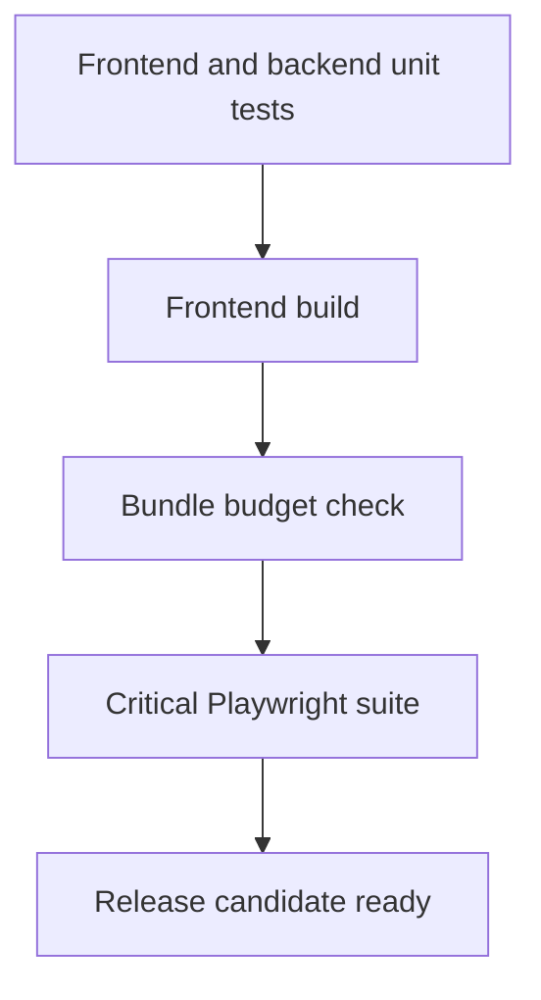

# Test Strategy Phase 2

## Test Layers

### Frontend Unit / Component
- toolchain: `Vitest`, `React Testing Library`
- focus:
  - auth store bootstrap behavior
  - login form
  - dashboard rendering
  - create case form flow

### Backend Route / Integration
- toolchain: `Vitest`, `Supertest`
- focus:
  - health endpoints
  - auth flows
  - DB-backed route contracts

### Browser E2E
- toolchain: `Playwright`
- focus:
  - login
  - dashboard load
  - create case
  - restart persistence
  - chatbot deterministic branch
  - chatbot LLM branch

## Commands

```powershell
npm run test:unit
npm run test:e2e
npm run test:smoke
npm run test:ci
```

## Required Scenarios
- login happy path
- invalid login rejection
- session bootstrap on refresh
- dashboard load for authenticated officer
- create case success
- case visible after backend restart
- chatbot missing-case guardrail
- chatbot deterministic fact answer
- chatbot irrelevant tagged question refusal
- chatbot LLM synthesis when Ollama is healthy

## CI Promotion Flow



## Nightly Smoke Expectations
- restart persistence scenario runs
- chatbot LLM branch runs
- latest backup metadata is present
- latest readiness endpoint payload is archived

## Exit Criteria
- all critical tests pass
- build succeeds
- bundle budget succeeds
- no blocker failures in health/readiness/startup endpoints
