# SHAKTI Admin Console Guide

## 1. Audit Summary: Is the Console Showing Real Data?

Yes, the admin console is connected to real backend APIs and real database-backed services. The dashboard, cases, ingestion workspace, normalization workspace, schema browser, storage view, users view, sessions view, alerts queue, and audit trail all call live backend endpoints from the admin frontend. Those backend endpoints in turn query production-style tables such as `cases`, `uploaded_files`, `ingestion_jobs`, `sessions`, `admin_sessions`, `audit_logs`, `admin_action_logs`, and schema metadata. This means the values an admin sees are not frontend mock cards or hardcoded fake numbers.

That said, the console is best described as **near real-time**, not continuous streaming. Most screens refresh on a polling interval. In the current implementation:

- dashboard-style operational queries refresh every 30 seconds
- session and audit-event-heavy views refresh every 15 seconds
- schema metadata refreshes every 60 seconds
- system and storage views refresh every 30 seconds

So if a case is updated, an upload finishes, or an alert is acknowledged, the UI reflects that change on the next poll or after a mutation invalidates the query. This is real data, but not WebSocket live telemetry.

There are also a few places where the console presents **derived** or **operator-friendly summaries** on top of real data. For example, dashboard charts are composed from recent case, file, activity, and analysis responses. The normalization mapping viewer uses real job data and sample records, but some mapping rows are assembled into a human-readable review format instead of exposing a raw ML trace. That is still grounded in real processing data, but it is a presentation layer.

Finally, not every visible control is fully write-enabled yet. Some pages are intentionally read-only or partially scaffolded. Examples:

- `Notes / Comments` in Case Detail is scaffolded for a later write phase
- Settings is currently posture-oriented, not a full writable system config editor
- Database storage/log toolbar search inputs are visible, but not yet wired into server queries
- Permission Matrix is currently a documented role map, not a dynamic policy editor

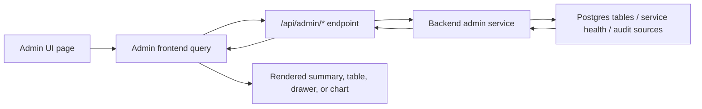

## 2. Global Shell, Navigation, and Operating Model

The admin console is designed as an operator workspace rather than a marketing dashboard. Every page follows the same basic pattern: a left sidebar for section switching, a compact header, a page title zone, a primary working surface, and a right-side drawer or inspector when the operator clicks into something. This consistency matters because admins move between cases, uploads, processing, logs, and audit evidence rapidly. The UI tries to avoid sending them into disconnected modal flows.

The left sidebar contains the top-level admin routes:

- Dashboard
- Cases
- Ingestion Pipeline
- Normalization & Processing
- Table Editor
- Database
- Users & Roles
- Audit Trail
- Alerts & Incidents
- Settings

The sidebar is collapsible. In expanded mode, icons and labels are shown together. In collapsed mode, the navigation becomes an icon rail, and the dedicated expand control sits in the sidebar footer. The goal is to preserve maximum content width for data-heavy pages such as Ingestion, Table Editor, and Database.

The top search bar is positioned as a global admin search affordance. It visually signals that the console is a connected workspace, although not every route currently consumes that top-level search input. The reliable, wired filters today are the page-local filters inside Cases, Ingestion, Table Editor, Audit Trail, and other individual workspaces.

Interaction model rules:

- clicking a row usually opens a right drawer, not a full page replacement
- clicking a major entity action opens a deeper route when more context is needed
- destructive or sensitive mutations require deliberate action and, in some cases, recent re-authentication
- route changes are used for big context changes, drawers are used for inspection

Legacy admin paths are redirected into the new routes, so older bookmarks continue to work:

- legacy overview -> Dashboard
- old activity -> Audit Trail
- old files -> Ingestion Pipeline
- old system -> Database `Observability`

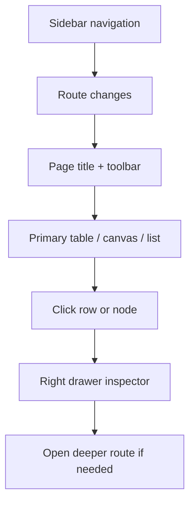

## 3. Dashboard

The Dashboard is the admin’s first-glance operational surface. Its purpose is not to show every possible metric; it is to answer three questions quickly:

1. What is active right now?
2. What needs attention?
3. Where should I go next?

The current dashboard pulls from multiple real backend sources:

- observatory summary
- alerts
- cases
- files
- activity feed
- analysis metrics

These are refreshed every 30 seconds, then composed into a compact summary strip, an operational feed table, an attention list, service posture summaries, and a tabbed analytics region.

What the admin sees:

- **summary strip**: Active Cases, Upload Failures, Running Jobs, Open Alerts, Active Users
- **operational feed**: recent admin and audit activity
- **attention list**: currently important alerts from the backend observatory
- **service posture**: backend, API, and pipeline readiness summaries
- **analytics tabs**:
  - Throughput
  - Failures
  - Usage

Important click behavior:

- clicking the attention chip labeled `Open` follows the alert’s remediation `href`
- `Open ingestion` in the Failures tab takes the user to Ingestion Pipeline
- `Open audit trail` in the review activity section takes the user to Audit Trail

The dashboard is workable today, but it is also intentionally compositional. It is not its own source of truth. When an admin sees a failure, stalled session, upload issue, or suspicious operator event here, the expected next step is to drill into the owning workspace rather than operate fully from the dashboard itself.

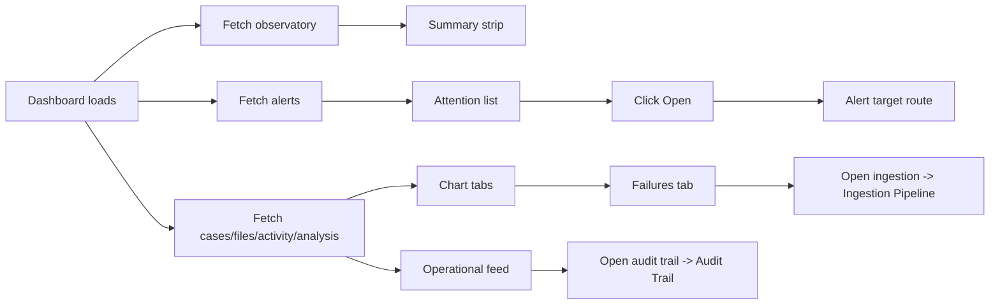

## 4. Cases

The Cases page is the governed case registry for admins. It answers: which investigations exist, which ones need attention, who owns them, and which cases have upload or processing problems. This page uses a real `getCases` backend query with server-side filters and a 30-second refresh cycle.

Main visible features:

- summary strip for total cases, high-priority cases, evidence-locked cases, and linked uploads
- filter bar with:
  - text search
  - status select
  - priority select
  - assigned officer input
- quick view tabs:
  - All Cases
  - Active
  - Needs Review
  - Closed
- dense case table
- row-driven right drawer inspector

What the table shows:

- case name and case number
- current status
- priority
- assigned officer
- creator
- upload count
- latest processing state
- last updated time

What happens on click:

- clicking a table row opens the case drawer
- the drawer shows ownership, department, created/updated timestamps, risk context, uploads/failures counts, and active assignments
- clicking `Open Case Detail` navigates to the full Case Detail route for that case

The `Needs Review` tab is especially useful for triage because it filters toward cases with failed parse files, pending files, or elevated priority. That makes it the best operational handoff view for supervisors and technical admins who need to find cases with backend-side friction.

The cases table is fully workable today. It is one of the strongest route entry points in the console because it links directly into case detail while still supporting broad registry browsing.

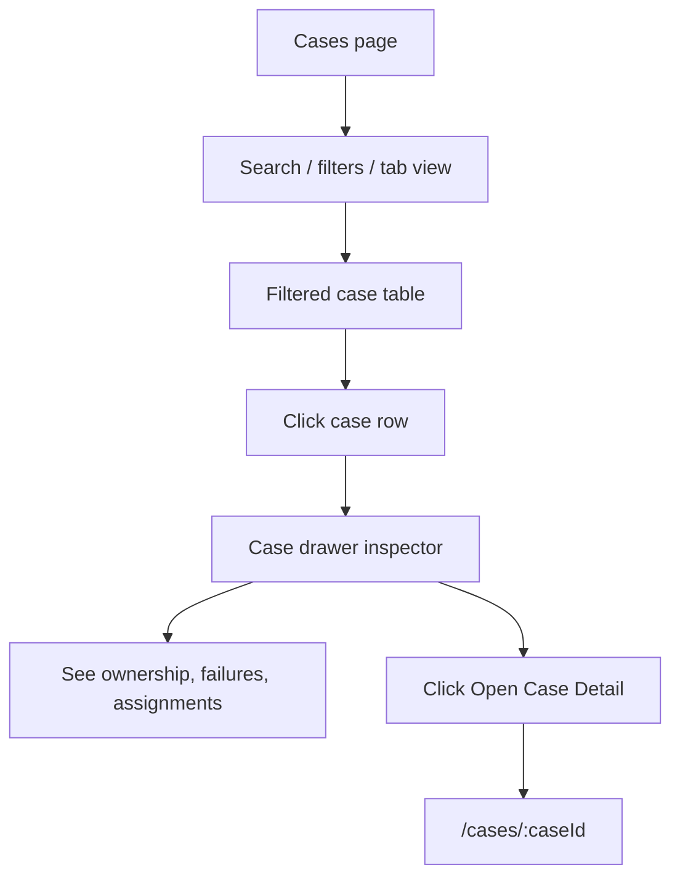

## 5. Case Detail

Case Detail is the routed, deeper workspace for one investigation. It exists because a right drawer is not enough once an admin needs uploads, processing progress, statistics, linked entities, event chronology, and audit evidence for a single case. The page refreshes from the backend every 30 seconds while the admin is viewing it.

Top-level behaviors:

- `Back to Cases` returns to the registry
- status and priority are shown at the top
- evidence lock is surfaced when enabled
- top metrics summarize uploads, failed uploads, assignments, recent activity, and timeline events

The tab structure is important:

- **Overview**: case metadata, owner, creator, type, summary, tags, and controls
- **Uploads**: recent files attached to the case
- **Processing**: stage cards from uploaded through analytics generated
- **Statistics**: parsed rows, invalid rows, duplicates, and low-confidence approximations
- **Timeline**: human-readable activity stream
- **Linked Entities**: currently derived from case file/module breakdown
- **Notes / Comments**: scaffolded placeholder for later write-enabled phase
- **Audit**: audit-style event history rendered from backend activity data

Context panel actions:

- `Open Ingestion Pipeline` -> `/ingestion-pipeline`
- `Open Audit Trail` -> `/audit-trail?caseId=<id>`
- `Open Alerts` -> `/alerts-incidents`
- `View audit evidence` -> `/audit-trail`

This page is highly usable for cross-functional review. A technical admin can inspect upload posture and processing state, while a supervisor can use the same screen to review assignment context and timeline evidence.

Current limitation to know:

- `Notes / Comments` is prepared visually but does not yet persist notes through a backend write flow

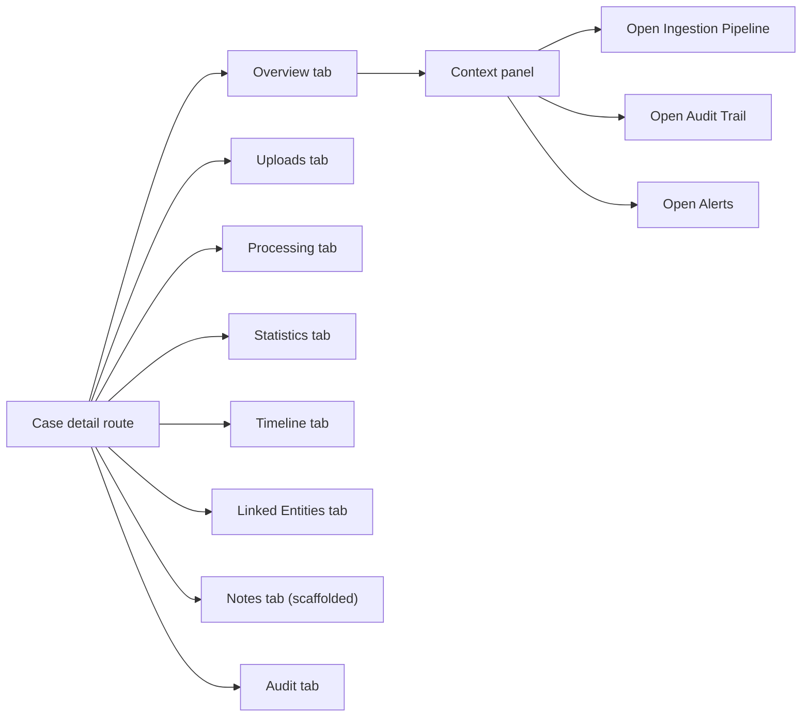

## 6. Ingestion Pipeline

The Ingestion Pipeline page is the operational intake queue for uploaded datasets. It is where admins verify that incoming evidence files were received, parsed, validated, linked into normalization, and, when necessary, investigated for failure. This page uses a real ingestion workspace backend endpoint and refreshes every 30 seconds.

The top summary strip currently shows:

- Files Uploaded Today
- Pending Parsing
- Parsing In Progress
- Validation Failures
- Successful Ingestions

The main working surface is the `Ingestion Queue` table. It is searchable and exposes:

- upload ID
- file name
- linked case
- source / type
- uploader
- upload time
- parse state
- validation state
- normalization job link
- extracted records
- error summary

What happens when the admin clicks a row:

- a right drawer opens for that upload
- the drawer shows uploader, type, upload time, size, parser version, normalizer version, checksum, warnings, retries, and linked context
- if the upload is linked to a case, `Open linked case` routes to Case Detail
- if the upload is linked to a normalization job, `Open processing` routes to Normalization & Processing with a `job` query parameter
- `Open audit trail` routes to Audit Trail filtered by upload ID

The three bottom sections are quick diagnostics, not fake decoration:

- ingestion throughput
- file type distribution
- failure rate by source

This page is one of the most actionable pages in the console because it connects an uploaded artifact to downstream processing and audit evidence in one place.

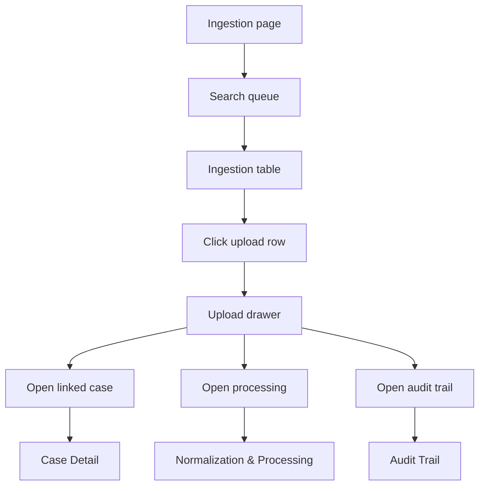

## 7. Normalization & Processing

The Normalization & Processing page is the admin-facing review surface for standardization jobs. It is not just a list of jobs; it is the place where a technical admin can inspect queue state, processing health, mapping confidence, conformity indicators, and downstream readiness. The page refreshes every 30 seconds through the normalization workspace endpoint.

Top summary strip:

- Jobs Running
- Jobs Completed
- Jobs Failed
- Average Job Duration
- Low Confidence Jobs

Queue features:

- text search across job, case, upload, and type
- real job table with version, duration, status, confidence, warnings, and errors
- row click opens a job drawer

Job drawer contents:

- case and upload linkage
- started/completed timestamps
- total rows and rejected rows
- confidence summary
- warning count
- error summary

The page’s lower section changes based on selection:

- when jobs exist and one is selected, the UI shows:
  - Raw vs Standardized Mapping Viewer
  - Normalization Timeline
  - Conformity & Anomalies
- when jobs exist but none is selected, the lower panels show compact instructional empty states
- when no jobs exist, the page collapses into one compact empty-state section instead of leaving oversized blank panels

Important truth for admins:

- the queue and summary are real backend data
- the mapping/timeline/anomaly view is grounded in real job/sample data but is also formatted into an operator-friendly review surface

This page is best used when troubleshooting low-confidence jobs, rejected rows, transformation issues, or downstream readiness questions.

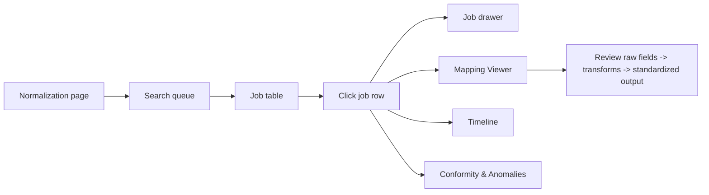

## 8. Table Editor

Table Editor is the safe visual data workspace. It is not a raw SQL editor. Its purpose is to let an admin browse governed tables, inspect real records, understand masking behavior, and review row-level metadata without needing query knowledge. It is intentionally read-only in the current phase.

The page is backed by real database schema and safe row-browse APIs:

- schema catalog query
- table metadata query
- paginated row query

Main controls:

- table picker
- table search
- row search on the current page
- visible columns dropdown
- page navigation

The summary strip tells the admin:

- how many tables are in the governed catalog
- which table is selected
- how many rows are visible in the current browse window
- whether the mode is read-only

What the admin can do:

- select a governed table
- browse a safe page of rows
- hide or reveal columns in the current view
- click a row to inspect it
- review whether the table is restricted, masked, or under large-table guards

Row click behavior:

- opens the row inspector drawer
- shows schema, type, row-count estimate, table size, browse mode, large-table guard state
- lists key fields and whether a field is PK, visible, or masked
- includes raw JSON for the selected row

This page is fully useful for auditing and data comprehension even without write capability. It supports support staff, DB admins, and investigators who need to verify values without exposing a dangerous low-level editing experience.

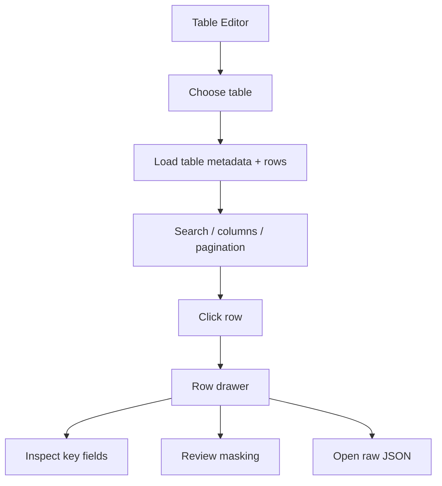

## 9. Database Workspace

The Database page is a multi-workspace backend view with four top tabs:

- Schema Visualizer
- Storage
- Observability
- Logs

This page is real-data-driven and combines schema metadata, storage registry data, system health, and recent activity records. It is designed for admins who need structural and operational visibility rather than direct row editing.

### Schema Visualizer

The schema canvas is backed by the database schema API and rendered as a node/relationship view. The search box filters visible tables on the canvas. `Fit canvas` is wired and re-centers the visualization. Clicking a node opens the table drawer, which shows:

- schema
- type
- row count estimate
- size
- last analysis timestamp
- columns and PK/nullability state
- `Open in Table Editor`

### Storage

This is the evidence asset registry. It shows real files, linked cases, sizes, integrity state, retention state, and upload actors. Clicking a row opens metadata such as checksum, storage path, legal hold, quarantine status, and linked job. The current top search box in this tab is present visually but is not yet wired into filtering logic.

### Observability

This tab flattens service posture into a table-first scan view. Clicking a service opens a drawer with details. It is driven by real health snapshot data.

### Logs

This tab is a technical/operational event table. Clicking a row opens the payload drawer. The visible search input is currently presentational and not yet wired into a server-side filter.

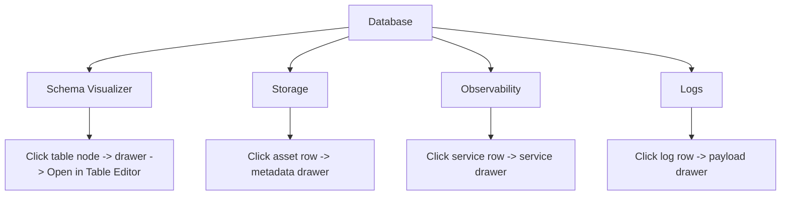

## 10. Users & Roles

Users & Roles is the identity governance surface. It combines officer accounts, admin accounts, active sessions, and a permission map so the admin can answer who has access, who is online, and whether a session needs to be terminated. It uses real backend user and session feeds, refreshed every 30 seconds for users and 15 seconds for sessions.

Top metrics:

- Total Users
- Active Today
- Locked Accounts
- Role Coverage

Tabs:

- **Users**
  - officer accounts table
  - admin accounts table
  - officer row click opens user drawer
- **Active Sessions**
  - live sessions table
  - `Force Logout` button per session
- **Permission Matrix**
  - current documented permission-to-role mapping

Important truth:

- officer/admin account data is real
- active session data is real
- `Force Logout` is a real mutation and may require recent re-authentication
- the Permission Matrix is currently a static frontend-defined operational map, not a live editable policy engine

When an officer row is clicked, the drawer shows:

- role
- department and station
- status
- last login
- recent actions
- open cases
- active sessions

When `Force Logout` is clicked:

- the session is selected
- if recent auth is still valid, the termination is executed
- otherwise a recent-auth dialog appears
- on success the users and sessions queries are invalidated and refreshed

This page is especially useful during suspicious behavior review, access audits, and live session governance.

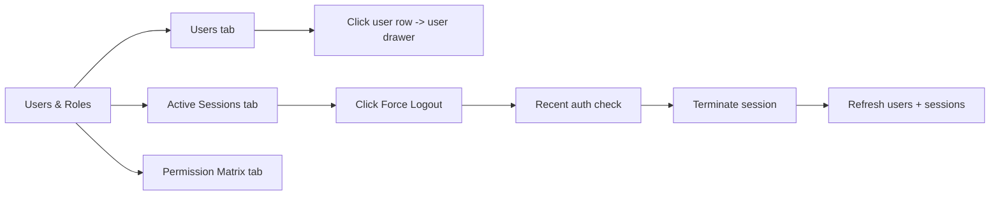

## 11. Audit Trail and Alerts & Incidents

These two pages are the governance core of the admin console.

### Audit Trail

Audit Trail is the immutable event ledger surface. It refreshes every 15 seconds and uses real activity data from both admin and officer-originated event streams. The top metrics summarize event counts in the visible filter state. The main filter today is the search box, which allows admins to query actor, action, case, session, IP, or object terms.

Clicking an event row opens the event drawer, which shows:

- timestamp
- actor
- role
- target type and target ID
- session
- metadata payload rendered as JSON

The `Before / After Diff` section currently displays the event `details` JSON directly. It is operationally useful, but it is not yet a specialized visual diff engine.

### Alerts & Incidents

Alerts is the active incident inbox. It is backed by real alert data and supports real acknowledgement writes. The page summarizes active, critical, unacknowledged, and acknowledged alerts. Clicking a row opens the alert drawer with:

- severity
- metric and threshold
- ack state
- ack owner/time
- summary
- remediation guidance
- acknowledgement note editor

Actions:

- `Open remediation target` routes to the alert’s linked target
- `Acknowledge alert` or `Update acknowledgement` writes back to the backend
- recent auth may be required before the write is allowed

Together, these pages let an admin prove what happened and record what was done.

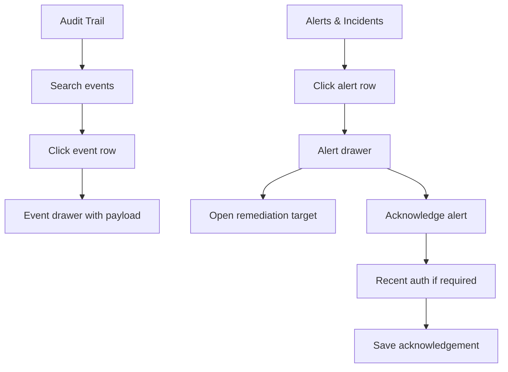

## 12. Settings, Known Limits, and Admin Operating Guidance

Settings is currently a **governed posture page**, not a full mutation console. It uses the real system health snapshot and groups configuration domains such as parser configuration, normalization, file types, retention, masking, integrations, environment posture, maintenance, and feature flags. The tabs are useful for understanding current backend posture, but not all of them are writable yet.

What Settings is good for today:

- checking backend readiness
- checking database status
- checking uploads/storage posture
- understanding what categories of settings exist
- confirming that privileged changes remain gated and audited

What Settings is not yet:

- a full write-enabled parser settings editor
- a feature-flag manager
- a retention policy editor
- a maintenance-mode control surface

### Recommended admin workflow

Use the console this way:

- start on **Dashboard** to identify the signal
- move to **Cases** when the problem is investigation-centric
- move to **Ingestion Pipeline** when the problem starts at file intake
- move to **Normalization & Processing** when the problem is mapping, confidence, or rejected rows
- move to **Table Editor** when you need row-level inspection
- move to **Database** when you need schema, storage, logs, or system posture
- move to **Users & Roles** when identity or session control is involved
- move to **Audit Trail** to reconstruct actions
- move to **Alerts & Incidents** to acknowledge or escalate operational signals

### Current known limitations to communicate internally

- no true streaming/live socket layer; polling-based freshness only
- Notes / Comments is scaffolded
- Settings is largely read-only
- some visible database toolbar inputs are not yet wired
- Permission Matrix is descriptive, not live-configurable

That is still a strong, usable admin console, but those limits should be understood before treating every visible control as fully interactive.

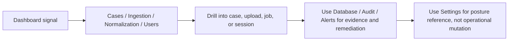
