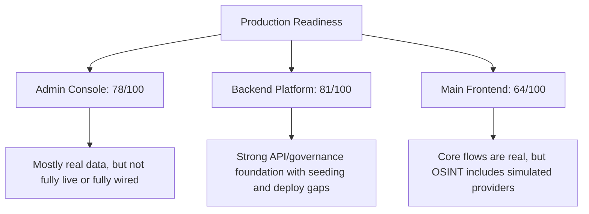
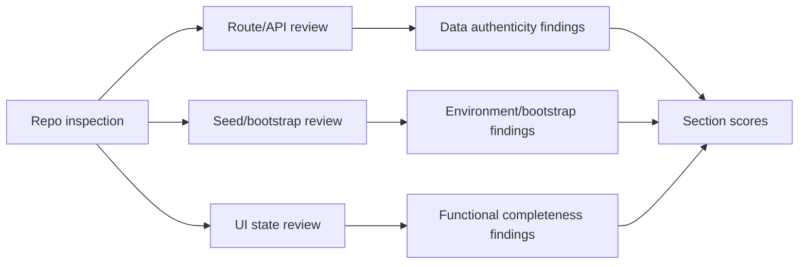
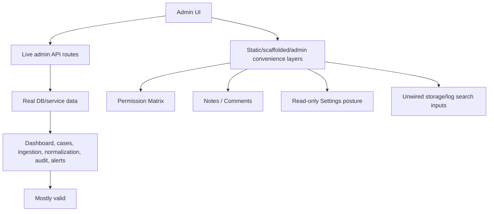
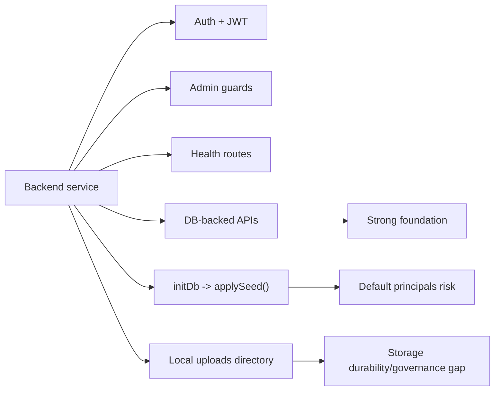
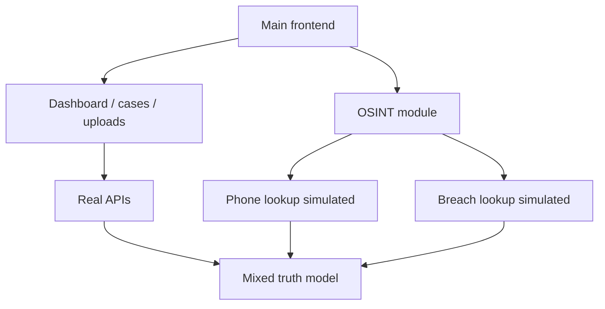
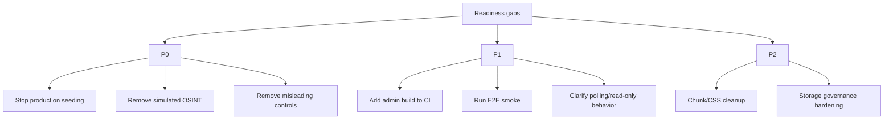

# SHAKTI Production Readiness Report

## 1. Executive Summary

This report audits SHAKTI as a whole, not just the backend admin console. It evaluates three major surfaces:

- Admin Console
- Backend Platform
- Main Frontend Application

The scoring model uses a maximum of **100 points per section**. Each section is broken into operational subcategories such as data authenticity, security, testing, functional completeness, and deployability. The purpose of the report is not to judge whether the project is “good enough” in general, but whether it is ready to be treated as a production-grade investigation system without hidden mock data, seeded defaults, or misleading operator behavior.

### Overall verdict

**Overall production readiness score: 74 / 100**

That score means the project is **operationally credible and technically buildable**, but **not yet clean enough to be declared fully production-ready without qualification**.

The strongest areas are:

- real backend-driven case, file, ingestion, normalization, audit, and admin data flows
- strong admin governance concepts such as recent re-auth, role checks, alert acknowledgement control, and audit logging
- working unit and integration test suites in both frontend and backend
- successful production builds for both main frontend and admin frontend
- bundle-budget guardrails already present

The biggest readiness gaps are:

- the admin console is **not fully live-streaming**; it is polling-based
- some admin surfaces are still **scaffolded, descriptive, or partially wired**
- the main frontend OSINT layer still exposes **simulated data sources**
- database initialization applies **development seed principals and known default credentials**
- CI currently covers frontend build and bundle budget, but does **not explicitly build the admin frontend**
- build output still shows CSS toolchain warnings and large chunk warnings

### Highest-risk conclusion

If the project were deployed today without hardening, the **biggest trust issue** would not be the admin dashboard itself. The biggest trust issue would be the combination of:

1. **seeded bootstrap identities**
2. **simulated OSINT results in the main user-facing product**
3. **partially scaffolded admin surfaces that look more complete than they actually are**



## 2. Audit Scope and Evidence

This report is based on direct inspection of the repository, targeted source review, and local verification runs. It is not a pure opinion document. The conclusions below are grounded in the current implementation.

### Evidence reviewed

- Admin route definitions in the frontend
- Admin API client wiring and query refresh behavior
- Admin backend routes and backend workspace services
- Main frontend dashboard, case workspace, and OSINT flows
- Backend app initialization, middleware, and database bootstrap logic
- Seed scripts and initialization behavior
- Test inventory and CI workflow coverage
- Production build output and bundle checks

### Verification commands run during this audit

```bash
npm run test --workspace=frontend
npm run test --workspace=backend
npm run build --workspace=frontend
npm run build:admin --workspace=frontend
npm run bundle:check
```

### Verification results

- Frontend unit tests: **20 / 20 passed**
- Backend unit/integration-style tests: **61 / 61 passed**
- Main frontend production build: **passed**
- Admin frontend production build: **passed**
- Bundle budget check: **passed**

### Important audit limitations

- End-to-end Playwright flows were **not executed in this audit pass**
- No code coverage threshold report was generated
- No production deployment target was exercised
- No live database contents were independently sampled outside the application context
- This audit confirms where data comes from in code; it does not certify the correctness of every row already stored in a live environment

### Core truth model used in this report

- **Real** means backed by live backend/database calls in the current code
- **Derived** means assembled from real data into summaries, charts, or operator-friendly presentation layers
- **Static** means frontend-defined configuration or descriptive UI content, not fetched from the server
- **Simulated** means intentionally fake or placeholder source behavior in the product



## 3. Scoring Framework

Each major section is scored out of **100**. Subcategories are also scored out of **100**, then weighted into a section score.

### Shared subcategory model

- **Data authenticity**: Is the displayed information real, current, and sourced from live APIs or storage?
- **Functional completeness**: Can the user actually do what the UI appears to support?
- **Security and governance**: Are sensitive actions protected, audited, and permission-aware?
- **Testing and reliability**: Are there meaningful automated tests and build checks?
- **Operational readiness**: Can this surface be trusted in a production operating model?

### Section score table

| Section | Score | Readiness Meaning |
|---|---:|---|
| Admin Console | 78 / 100 | Strong operational base, but not fully live, not fully complete |
| Backend Platform | 81 / 100 | Sound service foundation with notable bootstrap and deploy caveats |
| Main Frontend Application | 64 / 100 | Core flows are real, but user-facing simulation remains a blocker |
| **Overall Weighted Score** | **74 / 100** | Suitable for controlled rollout, not clean for unconditional production sign-off |

### Weighting logic

- Admin Console: 35%
- Backend Platform: 40%
- Main Frontend Application: 25%

The backend is weighted highest because every frontend surface depends on backend truth, auth, and data integrity. The admin console is weighted next because it is responsible for system governance and operator trust. The main frontend is weighted slightly lower only because the user specifically emphasized operational/admin truthfulness, not because the main app matters less.

## 4. Admin Console Audit

### Admin Console Score: **78 / 100**

| Subcategory | Score | Notes |
|---|---:|---|
| Data authenticity | 84 | Most admin data is real and backend-backed |
| Real-time behavior | 68 | Polling-based, not live streaming |
| Functional completeness | 73 | Several pages are strong, but some surfaces remain partial |
| Security and governance | 88 | Recent auth, role checks, origin/network guards, audit writes |
| Testing and reliability | 77 | Good backend/admin tests and stable builds |

### What is working well

The admin console is not a fake skin over placeholder metrics. Its core pages are backed by real backend endpoints:

- Dashboard
- Cases
- Case Detail
- Ingestion Pipeline
- Normalization & Processing
- Table Editor
- Database
- Users & Roles
- Audit Trail
- Alerts & Incidents
- Settings

The dashboard and admin workspaces use real routes such as:

- `/api/admin/observatory`
- `/api/admin/ops/ingestion`
- `/api/admin/ops/normalization`
- `/api/admin/ops/storage`
- `/api/admin/system/health`
- `/api/admin/alerts`
- `/api/admin/activity`
- `/api/admin/users`
- `/api/admin/sessions`
- `/api/admin/cases`
- `/api/admin/database/*`

Those endpoints resolve into backend services querying real tables and runtime health state. This means the admin console is mostly displaying valid information, not frontend-manufactured metrics.

### Important admin-console gaps

The admin console is **not fully “everything live and real-time”** in the strict sense. The main gaps are:

1. **Polling, not streaming**
   - Most admin views refresh every 15-60 seconds
   - This is near real-time, not event-streaming

2. **Derived operator summaries**
   - Dashboard charts and some monitoring cards are composed from live data
   - They are not fake, but they are not raw live telemetry feeds either

3. **Static or scaffolded surfaces**
   - `Notes / Comments` in Case Detail is explicitly scaffolded
   - `Permission Matrix` is static frontend-defined policy text, not server-driven RBAC metadata
   - `Settings` is posture-oriented and mostly read-only

4. **Visible but unwired controls**
   - Database `Storage` search box is visible but not wired to filtering logic
   - Database `Logs` search box is visible but not wired to server-side filtering logic

### Admin console conclusion

The admin console is **substantially real** and already usable for operator workflows. But it is **not accurate to claim that every surface is fully live, fully real-time, and fully complete**.



## 5. Backend Platform Audit

### Backend Score: **81 / 100**

| Subcategory | Score | Notes |
|---|---:|---|
| API and data integrity | 86 | Real DB-backed endpoints and scoped access patterns |
| Security and access control | 84 | JWT validation, admin guards, rate limits, recent auth |
| Testing and reliability | 85 | 61 backend tests passed; health and admin paths covered |
| Operational readiness | 74 | Good health endpoints, but bootstrap/seeding model is risky |
| Deployment hygiene | 76 | Buildable and structured, but production-hardening still needed |

### Positive findings

The backend has a solid production-oriented shape:

- Express service with modular routes
- Helmet enabled
- CORS allowlist enabled
- Rate limiting applied
- Separate admin auth routes and admin origin/network guards
- Health endpoints:
  - `/api/health`
  - `/api/health/live`
  - `/api/health/ready`
  - `/api/health/startup`
- Recent-auth protection for sensitive admin writes
- Audit logging for admin actions and operational writes
- Explicit JWT secret validation that rejects documented placeholder secrets

The backend test inventory is also meaningful:

- admin auth
- admin console
- admin database
- admin governance
- admin network guard
- admin operations
- case creation
- case lifecycle
- file classification
- health

This is stronger than a typical prototype backend.

### Highest-risk backend findings

1. **Database bootstrap applies development seed data**

`backend/config/initDb.js` always attempts `applySeed()` after schema application. The `database/seed.sql` file contains:

- seeded officers
- seeded users
- seeded admin account
- known default password `Shakti@123`

That is acceptable for development, but it is a serious readiness risk if a production environment can accidentally apply that seed set.

2. **Uploads are disk-backed**

The backend serves `/uploads` from a local directory. That is workable, but for production evidence-grade handling it raises questions around:

- durability
- backup policy
- lifecycle policy
- malware scanning
- immutable retention posture

3. **One legacy endpoint still returns a soft success response**

`POST /api/reset-settings` returns a success message while explicitly stating that no destructive reset occurred. That is safer than performing a reset, but it is also a legacy behavior that can confuse operators or automation if left exposed.

### Backend conclusion

The backend is structurally the strongest part of the project. It is not the main blocker. The biggest blocker is making sure production environments **cannot accidentally inherit development seed identities or passwords**.



## 6. Main Frontend Application Audit

### Main Frontend Score: **64 / 100**

| Subcategory | Score | Notes |
|---|---:|---|
| Data authenticity | 58 | Core case/dashboard flows are real, but OSINT still includes simulation |
| Functional completeness | 72 | Main investigation flows are usable |
| Testing and build reliability | 76 | Frontend tests pass and production build succeeds |
| Performance and bundle posture | 66 | Budget passes, but chunk-size warnings remain |
| Production readiness | 56 | Mixed truth model makes blanket production claims unsafe |

### What is real

The main frontend is not entirely fake. Important surfaces are live:

- Dashboard gets stats from `/api/dashboard/stats`
- Case list and case detail use real case APIs
- File upload and file listing use real file APIs
- Record counts for CDR/IPDR/SDR/Tower/ILD are requested from real endpoints

That means the investigation core is connected to real backend data.

### What is not production-clean

The main frontend currently contains a major truthfulness problem in the OSINT layer:

- phone lookup is explicitly **simulated**
- breach lookup is explicitly **simulated**
- the UI itself discloses this

Examples in code:

- `frontend/src/lib/osintApi.ts`
  - `Phone Number Validation (Simulated for on-premise)`
  - `Data Breach Check (Simulated)`
  - hardcoded `mockBreaches`
- `frontend/src/components/osint/OSINT.tsx`
  - operational note warns that phone validation and breach checks may use simulated data

That means the main application cannot be represented as fully live and fully real across all user-visible intelligence features.

### Build and UX notes

The main frontend build succeeded, and the bundle budget script passed. However:

- Vite/Lightning CSS still emits unknown-at-rule warnings
- chunk-size warnings remain for larger bundles
- the main dashboard still contains visually rich Aceternity-driven presentation layers, which are not a correctness issue but may complicate performance and maintainability over time

### Main frontend conclusion

The main frontend is the **largest blocker to a strict production-truth claim**, because simulated OSINT sources directly affect user trust.



## 7. Testing, CI, and Verification Posture

### Score contribution: **78 / 100**

This project has meaningful automated verification, but there is still a gap between “good local confidence” and “complete release confidence.”

### What exists today

- frontend unit tests with Vitest
- backend tests with Vitest
- Playwright E2E tests exist in `tests/e2e`
- CI workflow `phase2-readiness.yml`
- bundle-budget script

### What passed in this audit

- frontend tests: passed
- backend tests: passed
- main frontend build: passed
- admin frontend build: passed locally
- bundle budget: passed

### Notable gap: CI coverage mismatch

The current GitHub workflow runs:

- backend tests
- frontend tests
- main frontend build
- bundle budget

It does **not explicitly run**:

- admin frontend build
- Playwright E2E smoke or regression suite

That means one of the most critical operator-facing surfaces, the admin console, is verified locally but not fully guaranteed in CI by the current workflow.

### Additional quality observations

- frontend test output includes `HTMLCanvasElement.getContext()` warnings in jsdom
- this does not fail the suite, but it suggests canvas-dependent UI is not fully represented in unit tests
- no coverage enforcement is visible in the current scripts

### Testing conclusion

The project is ahead of many early-stage apps on basic automated checks, but it does not yet have the full “release gate” posture expected for a sensitive investigation platform.

## 8. Security and Governance Findings

### Score contribution: **82 / 100**

This area is good, but not complete.

### Strengths

- JWT secret validation rejects weak placeholder secrets
- rate limiting is applied to auth and API routes
- admin routes have additional guards
- admin-sensitive mutations use recent-auth verification
- admin actions are logged
- health, readiness, and startup status are exposed separately
- CORS uses an allowlist instead of `*`

### Gaps

1. **Development seed principals**
   - biggest governance risk

2. **Local upload storage**
   - may be insufficient for forensic-grade durability and retention without stronger storage controls

3. **Mixed truth in OSINT**
   - not a backend auth weakness, but it is a governance trust weakness

4. **Partially descriptive admin surfaces**
   - surfaces that look configurable but are actually posture-only can mislead operators unless documented clearly

### Security conclusion

The project has real governance intent and several good safeguards. The biggest issue is not missing auth middleware; it is the gap between secure concepts and fully production-clean operating conditions.

## 9. Priority Gaps and Required Remediation

### P0: Must fix before claiming production truthfulness

1. Remove or hard-gate development seed application in production
   - production startup must not auto-apply `seed.sql`
   - seeded admin/officer accounts and known passwords must never exist outside dev/test

2. Replace simulated OSINT providers
   - phone lookup and breach lookup must be backed by real internal/on-prem services, or be removed/disabled

3. Audit all operator-visible admin controls
   - anything visible but not wired should be hidden or clearly labeled read-only

### P1: Should fix before a formal rollout

1. Add admin frontend build to CI
2. Add at least one E2E smoke flow for admin console
3. Replace polling with event-driven refresh where operationally necessary, or document the polling model explicitly in the UI
4. Clarify Settings as posture-only until write paths exist
5. Replace JSON payload displays with clearer diff/rendering where audit review matters

### P2: Important hardening follow-ups

1. Reduce large JS chunks and review code splitting
2. Resolve CSS toolchain warnings
3. Improve storage governance around evidence assets
4. Add coverage targets or stronger release checks



## 10. Final Recommendation

### Can the admin console be described as fully valid, live, and real-time today?

**No, not in the absolute sense.**

More precise statement:

> The admin console is mostly backed by real backend and database data, refreshed on polling intervals, with some derived summaries, some read-only posture surfaces, and a few partially wired or scaffolded areas.

### Can the project as a whole be declared production-ready today?

**Not without qualification.**

### Recommended production posture label

Use one of these instead:

- **Controlled staging-ready**
- **Pilot-ready with hardening items**
- **Production-candidate, pending data-truth and bootstrap cleanup**

### Final scorecard

| Area | Score |
|---|---:|
| Admin Console | 78 / 100 |
| Backend Platform | 81 / 100 |
| Main Frontend | 64 / 100 |
| Testing & Verification Posture | 78 / 100 |
| Security & Governance Posture | 82 / 100 |
| **Overall Weighted Readiness** | **74 / 100** |

### Final sign-off position

SHAKTI is **close enough to support structured internal evaluation and controlled rollout**, but it is **not yet clean enough for a strict production sign-off** while:

- development seeding remains bootstrap-capable
- simulated OSINT remains visible in the main product
- some admin surfaces still imply more live functionality than they truly provide

